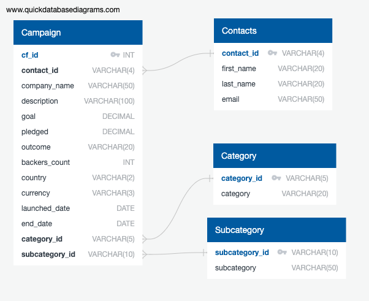
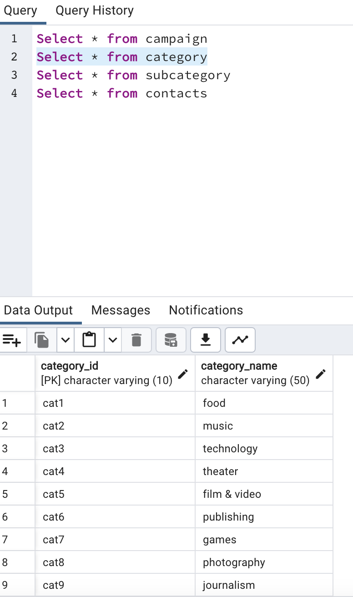
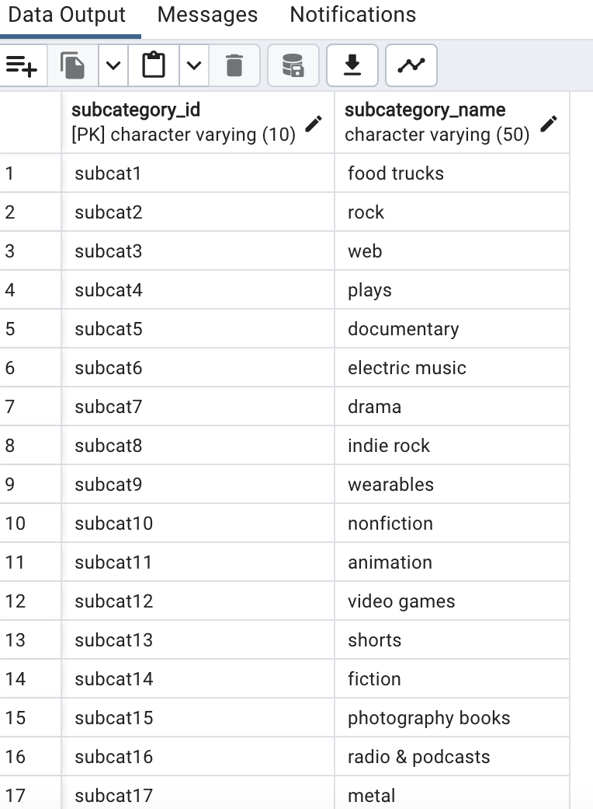
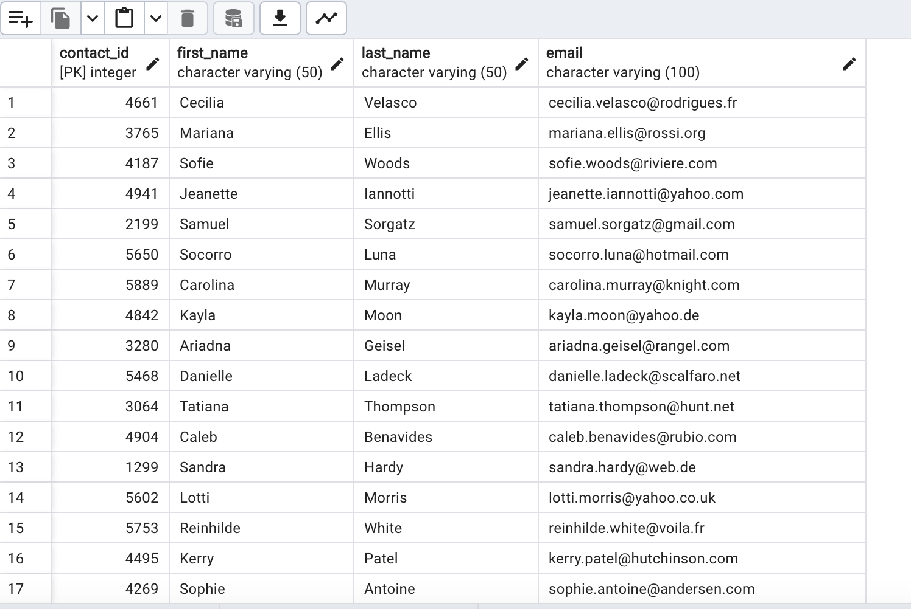
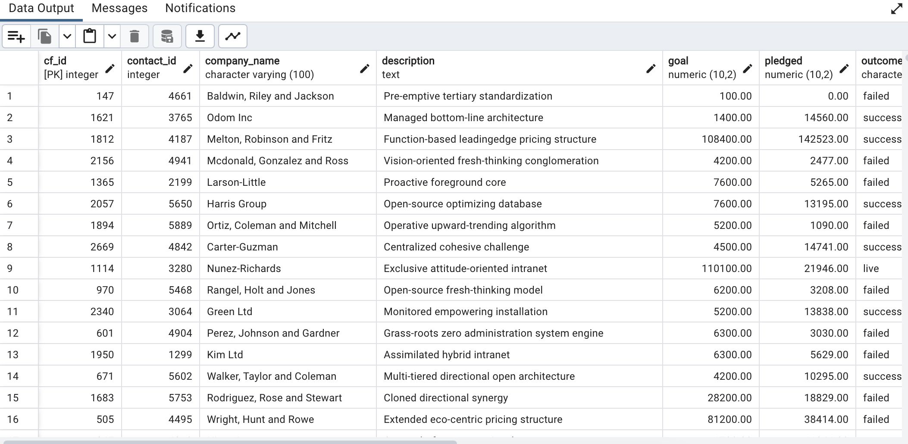

# Project 2: ETL Pipeline

## Table of Contents
- [About](#about)
- [Contributing](#contributing)
- [Key Steps](#key-steps)
- [Resources](#resources)
- [Database Tables](#database-tables)

## About
In this collaborative endeavor, we demonstrated our abilities to build an ETL pipeline using Python, Pandas, PyMongo and Python dictionary methods to extract and transform data. Using the transformed data, we exported four CSV files with valuable data. The CSV files helped us design an Entity-Relationship Diagram (ERD), establish a table schema, and successfully upload the CSV data into a Postgres database.

## Contributing
- <a href="https://www.github.com/agostinger/" target="_blank">Adam Gostinger</a>
- <a href="https://www.github.com/Ryguy57/" target="_blank">Ryan Himes</a>

## Key Steps:
1. **Created Category and Subcategory DataFrames**
   - Imported data from crowdfunding.xlsx using `pd.read_excel`.
   - Created a category DataFrame with "category_id" and "category" columns.
   - Created a subcategory DataFrame with "subcategory_id" and "subcategory" columns.

2. **Created the Campaign DataFrame**
   - Renamed and dropped unnecessary columns.
   - Changed data types (e.g., string to float, datetime).
   - Performed a SQL left join on category and subcategory tables to create a merged dataframe.

3. **Created the Contacts DataFrame**
   - Transformed data from contacts.xlsx into a contacts dataframe using Python dictionary methods.
   - Split the "name" column into first and last names.
   - Cleaned and exported the DataFrame as [contacts.csv](Resources/contacts.csv).

4. **Created the Crowdfunding Database**
   - Designed the database schema based on the ERD generated using [Quick DBD](http://www.quickdatabasediagrams.com/).

   

   - Created tables with appropriate data types, primary keys, and foreign keys.
   - Imported data from CSV files into the PostgreSQL database.
   - Verified data integrity by running SELECT statements.

## Resources
- [category.csv](Resources/category.csv)
- [campaign.csv](Resources/campaign.csv)
- [subcategory.csv](Resources/subcategory.csv)
- [contacts.csv](Resources/contacts.csv)

## Database Tables
<figure>
    <figcaption>Category Table</figcaption>
    
</figure>
 
<figure>
    <figcaption>Subcategory Table</figcaption>
    
</figure>
 
<figure>
    <figcaption>Contacts Table</figcaption>
    
</figure>
 
<figure>
    <figcaption>Campaign Table</figcaption>
    
</figure>

## Summary
This code performs various operations, including data reading, processing, cleaning, and restructuring from diverse sources. It generates new DataFrames with adjusted columns and data, culminating in the export of these refined DataFrames as CSV files. Additionally, the provided Entity-Relationship Diagram (ERD) illustrates the interconnections and dependencies among different data elements, offering a visual representation of the data's organization and relationships.
