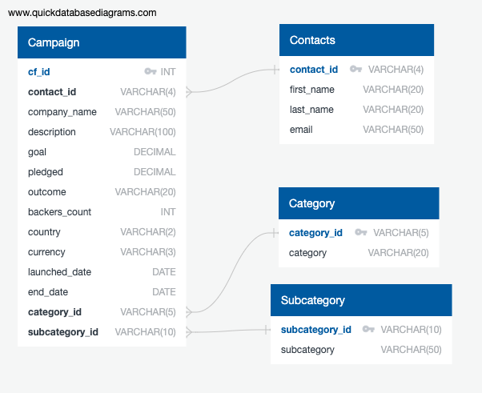

# Crowdfunding_ETL

Contributors: Adam Gostinger & Ryan Himes

7 September 2023

## Table of Contents
- [About](#about)
- [Getting Started](#getting_started)
- [Contributing](#contributing)
- [Summary](#summary)

## About
In this collaborative endeavor, we demonstrated our abilities to build an ETL pipeline using Python, Pandas, and Python dictionary methods to extract and transform data. Using the transformed data, we exported four CSV files with valuable data. The CSV files helped us design an Entity-Relationship Diagram (ERD), establish a table schema, and successfully upload the CSV data into a Postgres database.

## Getting Started
Jupyter Notebook, PGAdmin were required to run this project.

## Contributing
- <a href="https://www.github.com/agostinger/" target="_blank">Adam Gostinger</a>
- <a href="https://www.github.com/Ryguy57/" target="_blank">Ryan Himes</a>

## Summary
This code performs various operations, including data reading, processing, cleaning, and restructuring from diverse sources. It generates new DataFrames with adjusted columns and data, culminating in the export of these refined DataFrames as CSV files. Additionally, the provided Entity-Relationship Diagram (ERD) illustrates the interconnections and dependencies among different data elements, offering a visual representation of the data's organization and relationships.

